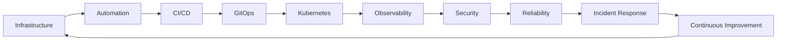
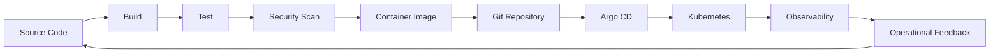
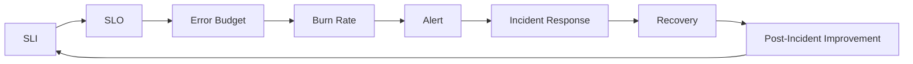
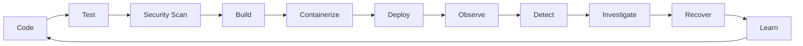
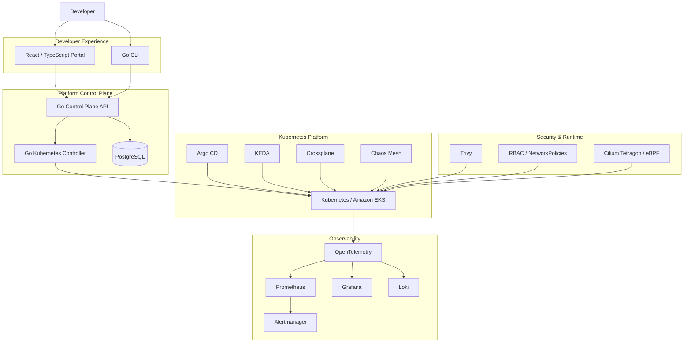
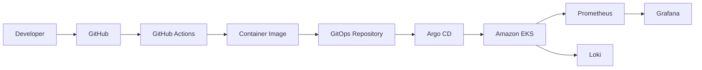
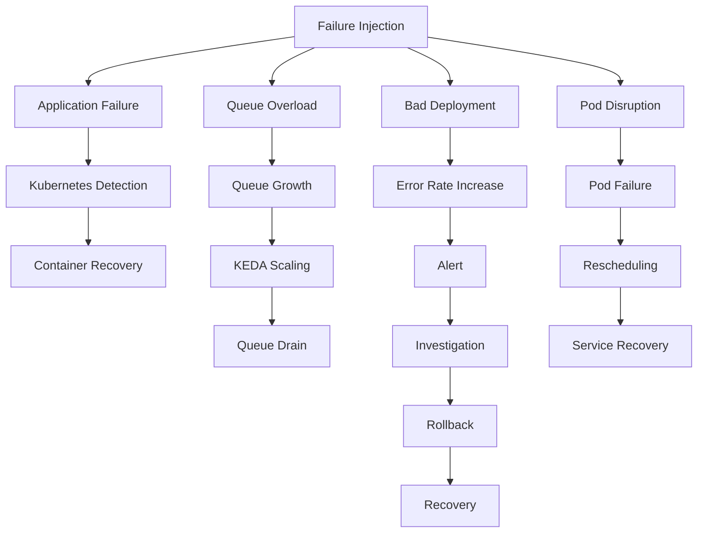
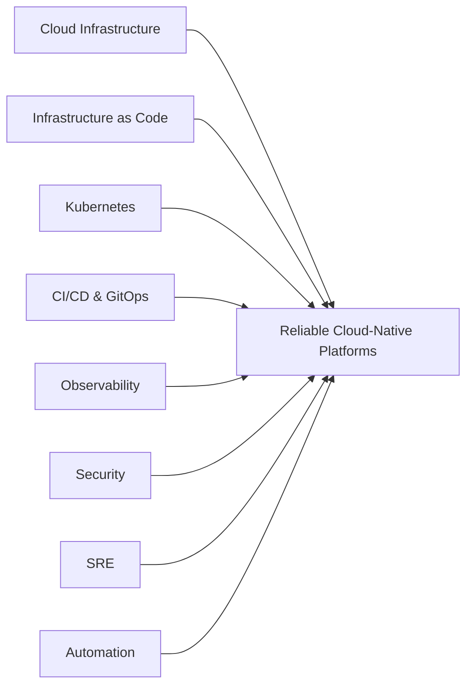

<div align="center">

# Kunal Waghmare

### DevOps Engineer · Site Reliability Engineer · Platform Engineer

**AWS · Kubernetes · Terraform · CI/CD · GitOps · Python · Observability · DevSecOps**

Designing, developing, automating, and operating reliable cloud-native infrastructure and Kubernetes platforms.

<p>
<a href="https://www.linkedin.com/in/kunal-waghmare-b48b1b226/">

</a>
<a href="https://devops-portfolio-chi.vercel.app/">

</a>
<a href="mailto:kunalwaghmare1207@gmail.com">

</a>
</p>

</div>

---

## About Me

I'm a **DevOps Engineer / Site Reliability Engineer with 3+ years of professional experience** designing, developing, automating, and operating cloud infrastructure, Kubernetes environments, CI/CD pipelines, and production-oriented engineering systems.

My core engineering focus sits at the intersection of:

**Cloud Infrastructure · Kubernetes · Infrastructure as Code · CI/CD · GitOps · Observability · Security · Reliability Engineering**

I work across the software delivery and operations lifecycle — from infrastructure provisioning and application delivery to monitoring, troubleshooting, incident response, recovery, and continuous improvement.



---

# Engineering at a Glance

| Area                           | Primary Technologies                                                          |
| ------------------------------ | ----------------------------------------------------------------------------- |
| **Cloud**                      | AWS · Amazon EKS · EC2 · VPC · IAM · RDS · S3 · CloudWatch · GCP              |
| **Infrastructure as Code**     | Terraform · Ansible                                                           |
| **Containers & Orchestration** | Docker · Kubernetes · Helm · Kustomize                                        |
| **CI/CD**                      | GitHub Actions · Jenkins · GitLab CI                                          |
| **GitOps**                     | Argo CD                                                                       |
| **Platform Engineering**       | Internal Developer Platforms · Control Planes · Kubernetes Controllers · CRDs |
| **Observability**              | Prometheus · Grafana · Loki · Alertmanager · OpenTelemetry · ELK · Jaeger     |
| **SRE**                        | SLI · SLO · Error Budgets · Burn Rate · Incident Response · Runbooks          |
| **Security**                   | Trivy · IAM · RBAC · NetworkPolicies · SecurityContexts                       |
| **Runtime Security**           | eBPF · Cilium Tetragon                                                        |
| **Autoscaling**                | HPA · KEDA                                                                    |
| **Chaos Engineering**          | Chaos Mesh                                                                    |
| **Programming & Automation**   | Python · Go · Bash · PowerShell · TypeScript · Node.js · Groovy               |
| **Operating Systems**          | Linux · Ubuntu · RHEL · Windows Server                                        |

---

# What I Do

### ☁️ Cloud Infrastructure

**Design · Provision · Configure · Operate · Maintain · Troubleshoot**

I work with cloud infrastructure and Infrastructure as Code to build repeatable environments and reduce manual operational work.

Key areas:

* AWS infrastructure
* Amazon EKS
* VPC and networking
* IAM
* RDS
* S3
* CloudWatch
* Terraform
* Ansible
* Infrastructure automation
* Environment validation

---

### ☸️ Kubernetes & Platform Engineering

**Design · Develop · Integrate · Automate · Operate · Improve**

I build Kubernetes-oriented platforms with an emphasis on repeatability, automation, observability, security, and developer experience.

Key areas:

* Kubernetes
* Amazon EKS
* Docker
* Helm
* Kustomize
* Kubernetes Controllers
* Custom Resource Definitions
* Reconciliation
* RBAC
* NetworkPolicies
* KEDA
* Crossplane
* Internal Developer Platforms

---

### 🚀 CI/CD & GitOps

**Develop · Integrate · Automate · Standardize · Deploy**

I develop delivery workflows that connect source control, testing, security, containerization, deployment, and operational feedback.



Technologies:

* GitHub Actions
* Jenkins
* GitLab CI
* Docker
* Helm
* Argo CD
* Kubernetes
* GitOps

---

### 🔭 Observability & Operations

**Instrument · Collect · Analyze · Detect · Diagnose · Investigate · Resolve**

I treat observability as an engineering capability rather than simply a monitoring dashboard.

**Metrics**

Prometheus · CloudWatch

**Logs**

Loki · ELK

**Traces**

OpenTelemetry · Jaeger

**Visualization**

Grafana

**Alerting**

Alertmanager

Operational signals include:

* Availability
* Latency
* Traffic
* Errors
* Saturation
* Resource utilization
* Queue depth
* Worker processing rate
* Infrastructure health

---

### 🔐 DevSecOps

**Scan · Secure · Validate · Enforce · Strengthen**

Security is incorporated across infrastructure, application delivery, Kubernetes, and runtime operations.

Key practices:

* Container image vulnerability scanning
* Dependency vulnerability scanning
* Infrastructure configuration scanning
* IAM
* RBAC
* Least-privilege access
* NetworkPolicies
* SecurityContexts
* Kubernetes security
* Runtime visibility
* eBPF-based inspection

Tooling:

`Trivy` · `IAM` · `RBAC` · `Cilium Tetragon` · `eBPF`

---

### 🚨 SRE & Reliability Engineering

**Measure · Analyze · Detect · Diagnose · Recover · Improve**

I apply SRE concepts to connect system behavior with operational decisions.



Core areas:

* Service Level Indicators
* Service Level Objectives
* Error Budgets
* Burn Rate
* Golden Signals
* Alerting
* Incident Response
* Runbooks
* Failure Analysis
* Recovery Engineering
* Chaos Engineering

---

# Featured Engineering Projects

## 🏗️ OpsForge 2.0

### Internal Developer Platform · SRE · Cloud Native · DevSecOps

> **Build it. Deploy it. Observe it. Break it. Recover it.**

OpsForge 2.0 is my most comprehensive engineering project — a production-oriented **Internal Developer Platform and SRE engineering laboratory** designed to bring application delivery, Kubernetes, Infrastructure as Code, GitOps, observability, security, autoscaling, and reliability engineering into one cohesive system.

The project is built around a practical engineering question:

> **What does a modern DevOps / SRE / Platform Engineering workflow look like when the individual tools have to operate as one system?**

### Platform Lifecycle



### Architecture



### Engineering Capabilities

**Platform Engineering**

* Designed a platform control-plane architecture
* Developed a Go control plane
* Developed a Kubernetes controller
* Implemented CRD and reconciliation workflows
* Developed a React / TypeScript developer portal
* Developed a Go CLI
* Explored self-service platform workflows

**Cloud Infrastructure**

* AWS
* Amazon EKS
* VPC
* IAM
* RDS
* S3
* Terraform
* Crossplane

**Delivery Engineering**

* GitHub Actions
* Jenkins
* Argo CD
* Helm
* Kustomize
* GitOps

**Observability**

* OpenTelemetry
* Prometheus
* Grafana
* Loki
* Alertmanager
* Jaeger

**Security**

* Trivy
* RBAC
* NetworkPolicies
* SecurityContexts
* Cilium Tetragon
* eBPF runtime visibility

**Reliability**

* Golden Signals
* SLI / SLO
* Error Budgets
* Burn Rate
* Incident Response
* Chaos Mesh
* Failure recovery

### Engineering Problems Explored

* **Designed** a platform control-plane architecture.
* **Developed** Kubernetes controller and reconciliation workflows.
* **Automated** infrastructure provisioning.
* **Integrated** GitOps-based application delivery.
* **Implemented** centralized metrics, logs, and traces.
* **Configured** event-driven autoscaling with KEDA.
* **Analyzed** Kubernetes and infrastructure state.
* **Investigated** deployment and runtime failures.
* **Diagnosed** workload and infrastructure conditions.
* **Tested** controlled failure scenarios using Chaos Mesh.
* **Measured** reliability signals using SLI/SLO concepts.
* **Implemented** security controls across the platform.
* **Documented** operational validation and engineering findings.

### Validation Evidence

The repository includes validation evidence covering:

* Docker Compose service execution
* SRE log collection
* Kubernetes workload inspection
* Chaos Mesh experiment submission
* Terraform AWS infrastructure planning
* Environment lifecycle and cleanup

> **Note:** The evidence represents lab validation and engineering experimentation. It is not a claim that OpsForge operates as an always-on production service.

**Repository →** https://github.com/kunal-1207/OpsForge

---

# ⚔️ Valkyrie Platform

### AWS EKS · Terraform · Kubernetes · GitOps · Observability

Valkyrie is a production-oriented Kubernetes platform focused on AWS infrastructure, Kubernetes orchestration, automated delivery, security, and operational observability.

### Engineering Work

* **Designed** AWS infrastructure using Terraform.
* **Provisioned** Amazon EKS infrastructure.
* **Developed** Kubernetes deployment workflows.
* **Integrated** GitHub Actions CI pipelines.
* **Implemented** GitOps delivery using Argo CD.
* **Configured** Helm-based deployments.
* **Integrated** Prometheus and Grafana.
* **Implemented** Loki log aggregation.
* **Configured** Alertmanager.
* **Applied** IAM and RBAC security controls.
* **Integrated** Trivy security scanning.
* **Analyzed** application and platform health.



**Repository →** https://github.com/kunal-1207/valkarie_platform

---

# ☁️ Cloud Native DevOps Platform

### AWS · Terraform · Kubernetes · CI/CD · GitOps

A cloud-native DevOps platform developed to demonstrate infrastructure provisioning, container orchestration, automated delivery, GitOps, and observability.

### Engineering Areas

* AWS infrastructure
* Terraform
* Kubernetes
* Docker
* GitHub Actions
* Argo CD
* Prometheus
* Grafana
* CI/CD automation
* GitOps workflows

**Repository →** https://github.com/kunal-1207/cloud-native-devops-platform

---

# 🧠 Redis-Compatible Database

### Systems Engineering · Networking · Concurrency

A Redis-compatible in-memory database developed from scratch to explore networking, protocols, concurrency, and storage fundamentals.

### Implemented

* RESP protocol
* TCP socket server
* Concurrent client handling
* GET / SET / DEL / TTL
* Key-value storage
* Persistence
* Networking fundamentals

This project complements my infrastructure work by exploring the lower-level systems that cloud and platform engineers ultimately operate.

**Repository →** https://github.com/kunal-1207/redis-personal-project

---

# 🏥 Healthcare RCM Data Platform

### AWS · Terraform · ETL · Cloud Data Engineering

A production-oriented cloud data platform developed around healthcare Revenue Cycle Management workflows.

### Engineering Areas

* AWS
* Terraform
* ETL pipelines
* Data processing
* Cloud storage
* Medallion architecture
* Infrastructure automation

**Repository →** https://github.com/kunal-1207/rcm-data-platform

---

# 🧪 Failure Engineering

Reliable systems should be evaluated under failure, not only demonstrated during successful deployments.

OpsForge explores controlled failure scenarios including:



Chaos Mesh is used for controlled Kubernetes failure experiments.

The engineering objective is:

> **Can the platform detect the failure, maintain acceptable availability, recover, and provide enough telemetry for an engineer to diagnose the incident?**

---

# 🛠️ Technology Stack

### Cloud & Infrastructure

`AWS` · `Amazon EKS` · `EC2` · `VPC` · `IAM` · `RDS` · `S3` · `CloudWatch` · `GCP`

### Infrastructure as Code

`Terraform` · `Ansible`

### Containers & Kubernetes

`Docker` · `Kubernetes` · `Amazon EKS` · `Helm` · `Kustomize`

### CI/CD & GitOps

`GitHub Actions` · `Jenkins` · `GitLab CI` · `Argo CD`

### Observability & Monitoring

`Prometheus` · `Grafana` · `Loki` · `Alertmanager` · `OpenTelemetry` · `ELK` · `Jaeger` · `CloudWatch`

### Security & DevSecOps

`Trivy` · `IAM` · `RBAC` · `NetworkPolicies` · `SecurityContexts` · `Secrets Management`

### Runtime Security

`eBPF` · `Cilium Tetragon`

### Platform & Reliability

`KEDA` · `Crossplane` · `Chaos Mesh` · `SLI` · `SLO` · `Error Budgets` · `Burn Rate` · `Incident Response` · `Runbooks`

### Programming & Automation

`Python` · `Go` · `Bash` · `PowerShell` · `TypeScript` · `Node.js` · `Groovy`

### Operating Systems

`Linux` · `Ubuntu` · `RHEL` · `Windows Server`

---

# 🏅 Google Cloud

Google Cloud learning and skill-badge experience includes:

* Terraform infrastructure
* Kubernetes application deployment
* DevOps workflows
* Cloud Operations monitoring and logging
* Managed Service for Prometheus

---

# 🔬 Current Engineering Focus

I'm continuing to expand from traditional DevOps into **Platform Engineering, SRE, and cloud-native systems engineering**.

### Currently Exploring

* Kubernetes networking
* Kubernetes controllers and operators
* Internal Developer Platforms
* Platform APIs
* eBPF
* Runtime security
* Service mesh
* Distributed systems
* Advanced observability
* Event-driven architecture
* Multi-cluster Kubernetes
* Cloud security
* Chaos engineering
* Reliability automation

---

# 🧩 Engineering Strengths

| Strength        | Application                                                             |
| --------------- | ----------------------------------------------------------------------- |
| **Design**      | Cloud infrastructure, Kubernetes platforms, delivery workflows          |
| **Develop**     | Automation, controllers, platform components, tooling                   |
| **Integrate**   | CI/CD, GitOps, observability, security, cloud services                  |
| **Automate**    | Infrastructure provisioning, deployments, diagnostics, operations       |
| **Analyze**     | Metrics, logs, traces, infrastructure state, workload behavior          |
| **Investigate** | Deployment failures, Kubernetes issues, infrastructure conditions       |
| **Diagnose**    | Availability, latency, errors, resource and workload problems           |
| **Implement**   | Security, monitoring, autoscaling, reliability workflows                |
| **Operate**     | Linux, Kubernetes, cloud infrastructure, application environments       |
| **Maintain**    | Infrastructure, workloads, automation, operational tooling              |
| **Standardize** | Infrastructure and deployment workflows                                 |
| **Secure**      | Cloud, Kubernetes, container environments                               |
| **Resolve**     | Infrastructure and deployment issues through structured troubleshooting |
| **Measure**     | Reliability, performance, and operational signals                       |
| **Improve**     | Deployment workflows, observability, and operational processes          |

---

# 🎯 Open to Opportunities

I'm interested in opportunities across:

**DevOps Engineer · Site Reliability Engineer · Platform Engineer · Cloud Infrastructure Engineer · DevSecOps Engineer**

I'm particularly interested in teams working with:

**AWS · Kubernetes · Terraform · CI/CD · GitOps · Cloud Infrastructure · Observability · Platform Engineering**

I bring a combination of:



---

# 📚 Engineering Philosophy

> **Good infrastructure should be reproducible.**
> **Good platforms should be self-service.**
> **Good systems should be observable.**
> **Good security should be built in.**
> **Good reliability should be measurable.**

I don't measure engineering quality by the number of tools in a stack.

I measure it by whether the system can:

```text
Deploy reliably
      ↓
Scale predictably
      ↓
Expose useful telemetry
      ↓
Detect failures
      ↓
Support investigation
      ↓
Recover safely
      ↓
Improve continuously
```

---

# 📫 Connect

<div align="center">

<a href="https://devops-portfolio-chi.vercel.app/">

</a>

<a href="https://www.linkedin.com/in/kunal-waghmare-b48b1b226/">

</a>

<a href="mailto:kunalwaghmare1207@gmail.com">

</a>

</div>

---

<div align="center">

### **Automate the infrastructure. Observe the system. Engineer the reliability.**

**DevOps · SRE · Platform Engineering · Cloud Infrastructure**

</div>
